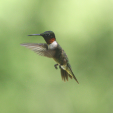
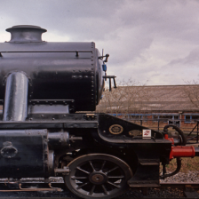

# Neighborhood Attention Transformer


Preprint Link: [Neighborhood Attention Transformer
](https://arxiv.org/abs/2204.07143)

By [Ali Hassani<sup>[1, 2]</sup>](https://alihassanijr.com/),
[Steven Walton<sup>[1, 2]</sup>](https://stevenwalton.github.io/),
[Jiachen Li<sup>[1,2]</sup>](https://chrisjuniorli.github.io/), 
[Shen Li<sup>[3]</sup>](https://mrshenli.github.io/), 
and
[Humphrey Shi<sup>[1,2]</sup>](https://www.humphreyshi.com/)

In association with SHI Lab @ University of Oregon & UIUC<sup>[1]</sup> and
Picsart AI Research (PAIR)<sup>[2]</sup>, and Meta/Facebook AI<sup>[3]</sup>


# News

### May 12, 2022
* [1-D Neighborhood Attention](NATTEN.md) support added!
* Moved the kernel to `natten/` now, since there's a single version for all three tasks, and we're adding more features to the extension.

### April 30, 2022
* CUDA extension v0.11 released.
  * It's faster in both training and inference, 
  * with a single version for all three tasks (no downstream-specific version)
* [PyTorch implementation](NATTEN.md) released
  * Works both with and without CUDA, but not very efficient. Try to use the CUDA extension when possible.

# Catalog
- [x] Neighborhood Attention 1D (CUDA)
- [x] Neighborhood Attention 2D (CUDA)
- [x] Neighborhood Attention 2D (PyTorch)
- [ ] Zeros/Valid padding support
- [ ] HuggingFace Demo

# Abstract


We present Neighborhood Attention Transformer (NAT), an efficient, 
accurate and scalable hierarchical transformer that works well on 
both image classification and downstream vision tasks. 
It is built upon Neighborhood Attention (NA), 
a simple and flexible attention mechanism that localizes the 
receptive field for each query to its nearest neighboring pixels. 
NA is a localization of self-attention, and approaches it as the 
receptive field size increases. 
It is also equivalent in FLOPs and memory usage to Swin 
Transformer's shifted window attention given the same receptive 
field size, while being less constrained. Furthermore, 
NA includes local inductive biases, which eliminate the need for 
extra operations such as pixel shifts. 
Experimental results on NAT are competitive; 
NAT-Tiny reaches 83.2% top-1 accuracy on ImageNet with only 
4.3 GFLOPs and 28M parameters, 
51.4% mAP on MS-COCO and 48.4% mIoU on ADE20k.


# How it works
Natural Attention localizes the query's (red) receptive field to its nearest neighborhood (green). 
This is equivalent to dot-product self attention when the neighborhood size is identical to the image dimensions. 
Note that the edges are special (edge) cases.


## Implementation
We wrote a [PyTorch CUDA extension](NATTEN.md) to parallelize NA. 
It's relatively fast, very memory-efficient, and supports half precision.
There's still a lot of room for improvement, so feel free to open PRs and contribute!
We've also released a [pure-torch version of Neighborhood Attention](NATTEN.md) recently.

# Results and checkpoints

## Classification
| Model | # of Params | FLOPs | Top-1 |
|---|---|---|---|
| NAT-Mini | 20M | 2.7G | [81.8%](http://ix.cs.uoregon.edu/~alih/nat/checkpoints/CLS/nat_mini.pth) |
| NAT-Tiny | 28M | 4.3G | [83.2%](http://ix.cs.uoregon.edu/~alih/nat/checkpoints/CLS/nat_tiny.pth) |
| NAT-Small | 51M | 7.8G | [83.7%](http://ix.cs.uoregon.edu/~alih/nat/checkpoints/CLS/nat_small.pth) |
| NAT-Base | 90M | 13.7G | [84.3%](http://ix.cs.uoregon.edu/~alih/nat/checkpoints/CLS/nat_base.pth) |


Details on training and validation are provided in [classification](classification/README.md).

## Object Detection
| Backbone | Network | # of Params | FLOPs | mAP | Mask mAP | Checkpoint |
|---|---|---|---|---|---|---|
| NAT-Mini | Mask R-CNN | 40M | 225G | 46.5 | 41.7 | [Download](http://ix.cs.uoregon.edu/~alih/nat/checkpoints/DET/nat_mini_maskrcnn.pth) |
| NAT-Tiny | Mask R-CNN | 48M | 258G | 47.7 | 42.6 | [Download](http://ix.cs.uoregon.edu/~alih/nat/checkpoints/DET/nat_tiny_maskrcnn.pth) |
| NAT-Small | Mask R-CNN | 70M | 330G | 48.4 | 43.2 | [Download](http://ix.cs.uoregon.edu/~alih/nat/checkpoints/DET/nat_small_maskrcnn.pth) |
| NAT-Mini | Cascade Mask R-CNN | 77M | 704G | 50.3 | 43.6 | [Download](http://ix.cs.uoregon.edu/~alih/nat/checkpoints/DET/nat_mini_cascademaskrcnn.pth) |
| NAT-Tiny | Cascade Mask R-CNN | 85M | 737G | 51.4 | 44.5 | [Download](http://ix.cs.uoregon.edu/~alih/nat/checkpoints/DET/nat_tiny_cascademaskrcnn.pth) |
| NAT-Small | Cascade Mask R-CNN | 108M | 809G | 52.0 | 44.9 | [Download](http://ix.cs.uoregon.edu/~alih/nat/checkpoints/DET/nat_small_cascademaskrcnn.pth) |
| NAT-Base | Cascade Mask R-CNN | 147M | 931G | 52.3 | 45.1 | [Download](http://ix.cs.uoregon.edu/~alih/nat/checkpoints/DET/nat_base_cascademaskrcnn.pth) |

Details on training and validation are provided in [detection](detection/README.md).

## Semantic Segmentation
| Backbone | Network | # of Params | FLOPs | mIoU | mIoU (multi-scale) | Checkpoint |
|---|---|---|---|---|---|---|
| NAT-Mini | UPerNet | 50M | 900G | 45.1 | 46.4 | [Download](http://ix.cs.uoregon.edu/~alih/nat/checkpoints/SEG/nat_mini_upernet.pth) |
| NAT-Tiny | UPerNet| 58M | 934G | 47.1 | 48.4 | [Download](http://ix.cs.uoregon.edu/~alih/nat/checkpoints/SEG/nat_tiny_upernet.pth) |
| NAT-Small | UPerNet | 82M | 1010G | 48.0 | 49.5 | [Download](http://ix.cs.uoregon.edu/~alih/nat/checkpoints/SEG/nat_small_upernet.pth) |
| NAT-Base | UPerNet | 123M | 1137G | 48.5 | 49.7 | [Download](http://ix.cs.uoregon.edu/~alih/nat/checkpoints/SEG/nat_base_upernet.pth) |

Details on training and validation are provided in [segmentation](segmentation/README.md).

# Salient maps

| Original | ViT | Swin | NAT |
|---|---|---|---|
|  |   |  |  |
|  |   |  |  |
|  |   |  |  |
|  |   |  |  |


# Citation
```bibtex
@article{hassani2022neighborhood,
	title        = {Neighborhood Attention Transformer},
	author       = {Ali Hassani and Steven Walton and Jiachen Li and Shen Li and Humphrey Shi},
	year         = 2022,
	url          = {https://arxiv.org/abs/2204.07143},
	eprint       = {2204.07143},
	archiveprefix = {arXiv},
	primaryclass = {cs.CV}
}
```
